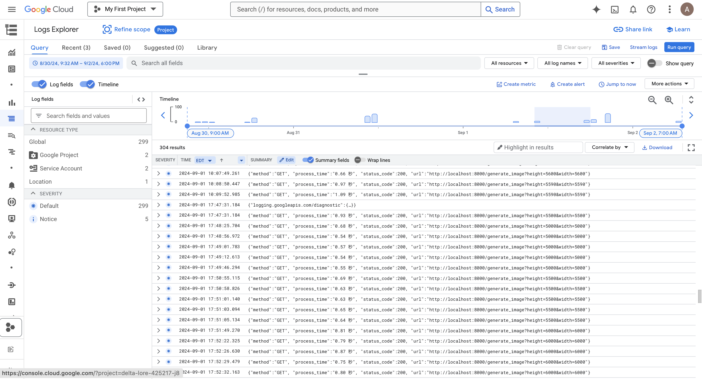
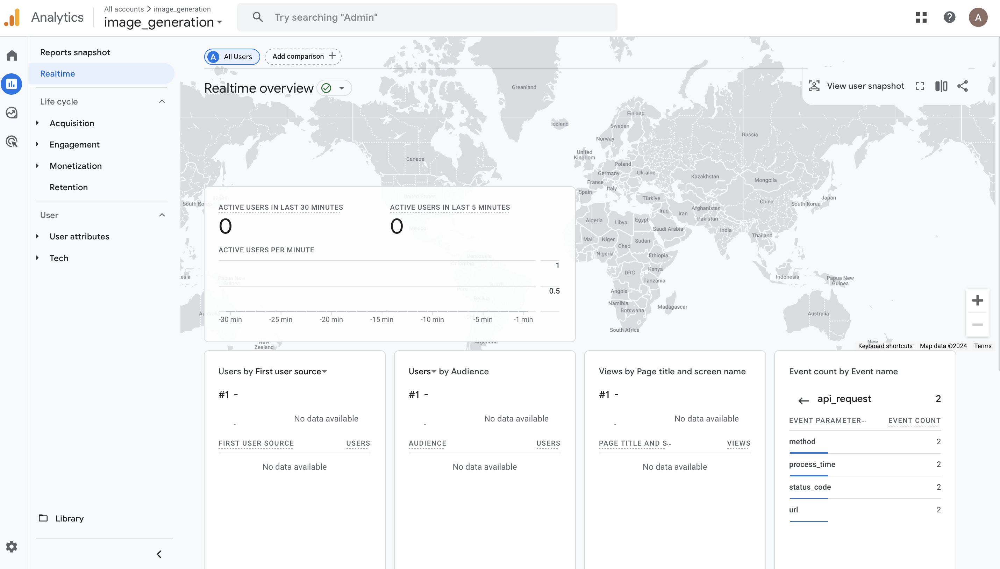

# Image Generation and Testing Project

This project includes a set of Python scripts for generating images, performing arithmetic operations, and running unit and integration tests. The main API server is built using FastAPI, with integration for Google Cloud Logging and Google Analytics event tracking.

## Table of Contents

- [Project Structure](#project-structure)
- [Installation](#installation)
- [Usage](#usage)
- [Features](#features)
- [Testing](#testing)
- [Google Cloud Logging and Google Analytics Integration](#google-cloud-logging-and-google-analytics-integration)

## Project Structure
`````
.
├── screenshots                 # Directory containing screenshots
│   ├── cloud_logging.png       # Screenshot showing Google Cloud Logging integration
│   └── google_analytics.png    # Screenshot showing Google Analytics event tracking
├── .env.template               # Template for environment variables configuration
├── .gitignore                  # Files and directories to be ignored by git
├── README.md                   # Project documentation with instructions and details
├── find_max_image_size.py      # Script to test maximum image dimensions
├── generate_image.py           # FastAPI server for generating images based on user input
├── integration_testing.py      # Integration tests for the API endpoints
├── requirements.txt            # Dependencies required to run the project
├── string_arithmetic.py        # Script for evaluating arithmetic expressions from strings
└── unit_testing.py             # Unit tests for the project functionality
`````


## Installation

1. Clone the repository:
   ```
   git clone https://github.com/anne116/generate_image_assignment.git
   ```
2. Create a virtual environment and install the required dependencies:
    ```
    python -m venv venv
    source venv/bin/activate  # For Windows, use venv\Scripts\activate
    pip install -r requirements.txt
    ```
3. Set up Google Cloud Logging:
    - Place your google_cloud_logging.json credentials file in the project root directory.
    
4. Set up Google Analytics:
    - Copy the `.env.example` file to `.env` and fill in your GOOGLE_ANALYTICS_MEASUREMENT_ID and GOOGLE_ANALYTICS_API_SECRET.


## Usage

1. For question one which performs arithmetic calculations from a string input:
    ```
    python string_arithmetic.py
    ```

2. For question two which generates image from height and width input. Run generate_image.py to start the FastAPI server:
    ```
    uvicorn generate_image:app --reload
    ```
    
3. You can test the API endpoint via browser or Postman:
    ```
    http://127.0.0.1:8000/generate_image?width=100&height=100
    ```

## Features

1. string_arithmetic.py: Safely evaluates arithmetic expressions from strings using Python.
2. generate_image.py: Provides an API endpoint using FastAPI to generate PNG images based on user-provided width and height.
3. find_max_image_size.py: Tests the performance of image generation for various sizes to find the maximum stable size.
4. unit_testing.py: Performs unit tests on the API endpoints, checking response status and performance metrics.
5. integration_testing.py: Runs integration tests, including concurrency testing to evaluate API performance and stability.

## Testing

- Run the following command to execute unit tests:
    ```
    pytest unit_testing.py
    ```
- Run the following command to execute integration tests:
    ```
    pytest integration_testing.py
    ```

## Google Cloud Logging and Google Analytics Integration

The API usage and execution events have been successfully logged to Google Cloud Logging and Google Analytics. Below are the steps and configurations:

1. **Google Cloud Logging**: Configured using `google_cloud_logging.json` and Python's Google Cloud Client.



2. **Google Analytics**: Implemented event tracking using Measurement Protocol with the correct `MEASUREMENT_ID` and `API_SECRET`.


